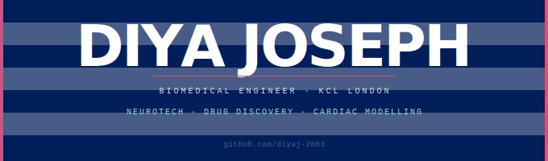

 

&nbsp;&nbsp;&nbsp;&nbsp;Biomedical Engineering — King's College London

&nbsp;&nbsp;&nbsp;&nbsp;Neurotech · Drug discovery · Computational modelling · Brain stimulation

 

---

 

&nbsp;&nbsp;&nbsp;&nbsp;**ARCHIVED RESEARCH**

 

&nbsp;&nbsp;&nbsp;&nbsp;`01` &nbsp; **Optimising Hippocampal Stimulation for Memory Consolidation** — MEng 2025

&nbsp;&nbsp;&nbsp;&nbsp;&nbsp;&nbsp;&nbsp;&nbsp;&nbsp;&nbsp;&nbsp;&nbsp;Personalised modelling of temporal interference electric fields using subject-specific MRI/DWI.
&nbsp;&nbsp;&nbsp;&nbsp;&nbsp;&nbsp;&nbsp;&nbsp;&nbsp;&nbsp;&nbsp;&nbsp;Quantified hippocampal field strength across 26 participants. Memory improvement correlated
&nbsp;&nbsp;&nbsp;&nbsp;&nbsp;&nbsp;&nbsp;&nbsp;&nbsp;&nbsp;&nbsp;&nbsp;with field strength in low encoders (r = 0.64). &nbsp;`Sim4Life` `SimNIBS` `Python`

 

&nbsp;&nbsp;&nbsp;&nbsp;`02` &nbsp; **Virtual Pacemapping — ECG Alignment for Arrhythmic Source Localisation** — BEng 2024

&nbsp;&nbsp;&nbsp;&nbsp;&nbsp;&nbsp;&nbsp;&nbsp;&nbsp;&nbsp;&nbsp;&nbsp;Aligned simulated and clinical 12-lead ECGs across 1,000 cardiac mesh nodes.
&nbsp;&nbsp;&nbsp;&nbsp;&nbsp;&nbsp;&nbsp;&nbsp;&nbsp;&nbsp;&nbsp;&nbsp;QRS start alignment outperformed DTW across all correlation metrics.
&nbsp;&nbsp;&nbsp;&nbsp;&nbsp;&nbsp;&nbsp;&nbsp;&nbsp;&nbsp;&nbsp;&nbsp;&nbsp;`Python` `NumPy` `SciPy` `Matplotlib` `DTW`

 

---

 

&nbsp;&nbsp;&nbsp;&nbsp;**BUILDING**

 

&nbsp;&nbsp;&nbsp;&nbsp;Neurotech

&nbsp;&nbsp;&nbsp;&nbsp;&nbsp;&nbsp;&nbsp;&nbsp;&nbsp;&nbsp;&nbsp;&nbsp;`MNE-Python` `EEGNet` `MOABB` `PyTorch` `taVNS` `HRV analysis`
&nbsp;&nbsp;&nbsp;&nbsp;&nbsp;&nbsp;&nbsp;&nbsp;&nbsp;&nbsp;&nbsp;&nbsp;`closed-loop systems` `LIF models` `Hodgkin-Huxley` `STDP`

 

&nbsp;&nbsp;&nbsp;&nbsp;Drug discovery

&nbsp;&nbsp;&nbsp;&nbsp;&nbsp;&nbsp;&nbsp;&nbsp;&nbsp;&nbsp;&nbsp;&nbsp;`RDKit` `DeepChem` `PyTorch Geometric` `ChEMBL` `ADMET`
&nbsp;&nbsp;&nbsp;&nbsp;&nbsp;&nbsp;&nbsp;&nbsp;&nbsp;&nbsp;&nbsp;&nbsp;`AutoDock Vina` `PyMOL` `GROMACS` `Scanpy`

 

&nbsp;&nbsp;&nbsp;&nbsp;Infrastructure

&nbsp;&nbsp;&nbsp;&nbsp;&nbsp;&nbsp;&nbsp;&nbsp;&nbsp;&nbsp;&nbsp;&nbsp;`Git` `GitHub` `Jupyter` `Docker` `Snakemake` `LaTeX`

 

---

 

&nbsp;&nbsp;&nbsp;&nbsp;pianist &nbsp;·&nbsp; digital artist &nbsp;·&nbsp; web builder &nbsp;·&nbsp; Bengaluru

&nbsp;&nbsp;&nbsp;&nbsp;[linkedin](https://linkedin.com/in/YOURUSERNAME) &nbsp;·&nbsp; [email](mailto:YOUREMAIL)

 
